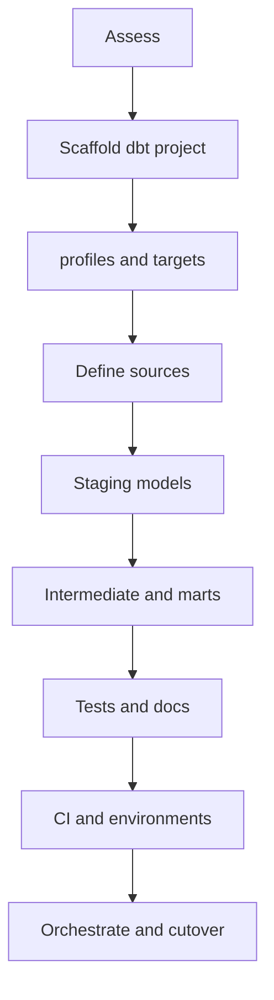

# Migration to dbt — step-by-step guide

This document describes a practical path to **adopt dbt** when you already have **Snowflake** (and optionally **ELT loaders**, **Salesforce**, or **integration stored procedures**). It is not a single “big bang” cutover; it is usually **phased** so analytics and quality improve before you touch risky operational pipelines.

**Related docs:** [Salesforce + Snowflake + dbt](README_Salesforce_Snowflake.md), example project [`my_dbt/README.md`](my_dbt/README.md).

---

## Where the migration happens (two directories)

A migration has a **source** (existing Snowflake integration scripts) and a **target** (the dbt project where new models live). They are **not** the same folder.

### Source — existing integration SQL (U8)

This is the directory that holds **today’s** Snowflake stored procedures and related scripts you are assessing or gradually replacing with dbt-friendly patterns:

| Role | Path |
|------|------|
| **Integration / procedures (read here)** | `/Users/thongbui/open_issue/U8_WHSE/P1062_U8_SN0_to_UpdateGitSnowflake/STAGING/U8_INTEGRATIONS` |

Typical layout: `procedures/*.sql` — `MERGE`/`UPDATE` flows, snapshot `CLONE` jobs, ownership helpers, ops logging (`INT_OPS`, `MSG_OPS`). **You do not run `dbt` from this directory.** Use it for **Phase 0** inventory, naming conventions (`DS*_II`, `*_MI`), and deciding what stays as procedures vs what becomes dbt models.

### Target — dbt project (run CLI here)

In **this git repository** (`python_project`), the dbt project you migrate **into** lives here:

| Role | Path | Notes |
|------|------|--------|
| **dbt project root** | `dbt/my_dbt/` (from repo root) | `dbt_project.yml`, `models/`, `tests/`, `seeds/`. **Run every `dbt` command from this directory.** |
| **Guides** | `dbt/` | `README_Migration_to_dbt.md`, `README_Salesforce_Snowflake.md` — documentation only. |
| **Python env (optional)** | `dbt/venv312/` | Activate before `dbt` if you use this venv (`my_dbt/README.md`). |

Example — **from `python_project` repo root**:

```bash
cd dbt/my_dbt
source ../venv312/bin/activate   # optional
dbt debug
```

If you scaffold another project with `dbt init`, keep one documented **target** path for the team (for example still under `dbt/<name>/`).

### Flow

1. **Edit / review** legacy logic under `.../U8_INTEGRATIONS` (or deploy procedures from that tree to Snowflake).
2. **Author and run** dbt models under `python_project/dbt/my_dbt/` (or your chosen dbt root).
3. Point dbt **`sources.yml`** at the Snowflake tables **produced by** those procedures, not at the `.sql` files on disk.

---

## What “convert to dbt” usually means

dbt is best at **versioned transformations** in the warehouse: **SQL models**, **tests**, **documentation**, and **lineage**. It does **not** replace every Snowflake **stored procedure** (cursors, multi-step transactions, dynamic `CLONE`, or email queues). A typical migration **moves read-only analytics and reporting SQL into dbt**, and **keeps** procedural integration jobs in Snowflake **until** you deliberately refactor them.

---

## Migration phases at a glance



---

## Phase 0 — Assess and scope

1. **Inventory existing SQL** — List views, ad-hoc reports, BI extracts, and scheduled SQL that **only read** warehouse tables and could become **dbt models**.
2. **Inventory what must stay** — Stored procedures that **loop**, **call other procedures**, manage **transactions** and **rollback**, or write **ops/notification** tables (`MSG_OPS`, `INT_OPS`) often stay **outside** dbt until you have a strong reason to change them.
3. **Pick boundaries** — Decide: “dbt owns everything **after** schema `X`” or “dbt owns **marts** only; raw and integration stay as-is.”
4. **Naming targets** — Align **dev** and **prod** databases/schemas (for example `_DEV` suffix vs production) with dbt **targets** in `profiles.yml`.
5. **Stakeholders** — Agree who approves model changes (data team) vs who runs integration jobs (ops).

---

## Phase 1 — Scaffold the dbt project

1. **Install** the adapter for your warehouse, for example:

   ```bash
   pip install "dbt-snowflake>=1.7,<2"
   ```

2. **Create a project** (or copy a starter template). Run `dbt init` from the **parent** of where you want the project folder, then `cd` into the new project directory (or use the existing **`dbt/my_dbt/`** directory in this repo):

   ```bash
   cd dbt
   dbt init your_project_name
   cd your_project_name
   ```

3. **Set** `project_name`, `profile`, and paths in **`dbt_project.yml`** inside that project directory (`model-paths`, `test-paths`, `seed-paths`, …).
4. **Folder convention** (common): `models/staging/`, `models/intermediate/`, `models/marts/`; keep **one concern per layer** so newcomers navigate easily.

---

## Phase 2 — Connect Snowflake (`profiles.yml`)

1. Create a **profile** per project (often `~/.dbt/profiles.yml` or environment variables in CI).
2. Define **outputs** for at least **`dev`** and **`prod`** (or `prod` and `ci`): different **database**, **schema**, **warehouse**, **role**, or **credentials**.
3. Prefer **key-pair auth** for service users; avoid committing secrets to git.
4. From your **dbt project directory** (e.g. `dbt/my_dbt`), run:

   ```bash
   dbt debug
   dbt debug -t prod   # verify each target you use
   ```

   and fix connection issues before modeling.

### What the files look like (Phase 2)

**Location:** `~/.dbt/profiles.yml` (or a path you set with `DBT_PROFILES_DIR`). **Do not** commit this file with real secrets; in CI, build `profiles.yml` from secrets or use env-based auth.

**Shape:** the **top-level key** must match `profile: ...` in `dbt_project.yml`. Each **output** is a named Snowflake connection; **`target`** picks the default when you omit `-t`.

```yaml
my_dbt:
  target: dev
  outputs:
    dev:
      type: snowflake
      account: xy12345.us-east-1
      user: YOUR_DEV_USER
      role: DBT_DEV_ROLE
      database: ANALYTICS_DEV
      warehouse: WH_ANALYTICS_DEV
      schema: DBT_DEFAULT_DEV
      threads: 4
      private_key_path: /path/to/dev_rsa_key.p8
    prod:
      type: snowflake
      account: xy12345.us-east-1
      user: SVC_DBT_PROD
      role: DBT_PROD_ROLE
      database: ANALYTICS_PROD
      warehouse: WH_ANALYTICS_PROD
      schema: DBT_DEFAULT_PROD
      threads: 8
      private_key_path: /path/to/prod_rsa_key.p8
```

`schema` here is often dbt’s **default build schema** for models unless you override with custom schemas in `dbt_project.yml`.

---

## Phase 3 — Declare sources (`sources.yml`)

1. **List** tables or views that **dbt reads but does not own** (raw loads, integration tables, Salesforce mirrors).
2. For each **source**, set `database`, `schema`, and `tables` in `models/.../sources.yml`.
3. Use **`source('name','table')`** in staging models instead of hard-coded `database.schema.table` (easier environment moves and renames).
4. Optionally add **freshness** and **descriptions** for critical tables.

### What the files look like (Phase 3)

**Typical path:** `models/staging/_u8__sources.yml` (any `*.yml` under `models/` is fine; group by domain).

```yaml
version: 2

sources:
  - name: u8_integrations
    description: >-
      Output of U8 Snowflake procedures (STAGING.U8_INTEGRATIONS).
    database: "{{ target.database }}"
    schema: U8_INTEGRATIONS
    tables:
      - name: E1_MI
        description: Master integration table for entity E1
        columns:
          - name: MI_ID
            description: Surrogate key / business key for MI
          - name: DS01_II_ID
            description: Link to DS01_E1_II integration row
      - name: DS01_E1_II
        description: Salesforce-shaped / duplicate-merge staging for DS01
```

Tables such as `E1_MI` are **examples** — match **real** Snowflake `database.schema.table` names. If raw data always lives in one database, you can hard-code `database: ANALYTICS_PROD` instead of `target.database`; using `target` keeps dev/prod aligned.

---

## Phase 4 — Build staging models

1. **One staging model per source entity** (or per logical group) — thin layer: **rename**, **cast**, **dedupe keys**, **standardize** column names.
2. **Materialization** — Often **`view`** for staging to reduce storage churn; use **`table`** if performance requires it.
3. **Do not** duplicate heavy integration logic here if it already lives in procedures; **stage what the integration layer already produced**.

### What the files look like (Phase 4)

**Typical path:** `models/staging/stg_u8__e1_mi.sql` (prefix `stg_`, double underscore before entity name is a common convention).

```sql
{{ config(materialized="view") }}

select
    mi_id,
    ds01_ii_id,
    ds01_id,
    ds01_name,
    ds01_isdeleted
from {{ source("u8_integrations", "E1_MI") }}
```

**Optional `dbt_project.yml` defaults** for everything under `models/staging/`:

```yaml
models:
  my_dbt:
    staging:
      +materialized: view
```

Replace `my_dbt` with your project name from `name:` at the top of `dbt_project.yml`.

---

## Phase 5 — Intermediate and marts

1. **Intermediate** — Joins and business rules that are **reused** by multiple marts.
2. **Marts** — Fact/dimension or wide tables for **BI** and **metrics**; stable contracts for downstream tools.
3. **Use `ref()`** only between **dbt models**; use **`source()`** for raw/integration inputs.
4. **Materialization** — Often **`table`** or **`incremental`** for large marts (choose strategy with your warehouse’s strengths).

### What the files look like (Phase 5)

**Intermediate —** `models/intermediate/int_u8__e1_mi_with_ds01.sql`:

```sql
{{ config(materialized="view") }}

select
    mi.mi_id,
    mi.ds01_id,
    mi.ds01_name,
    mi.ds01_isdeleted,
    ii.ii_id as ds01_ii_id,
    ii.duplicate_group__c
from {{ ref("stg_u8__e1_mi") }} as mi
left join {{ source("u8_integrations", "DS01_E1_II") }} as ii
    on mi.ds01_ii_id = ii.ii_id
```

**Mart —** `models/marts/mart_u8__e1_account_enriched.sql`:

```sql
{{ config(materialized="table") }}

select
    mi_id,
    ds01_id,
    ds01_name,
    duplicate_group__c
from {{ ref("int_u8__e1_mi_with_ds01") }}
where coalesce(ds01_isdeleted, false) = false
```

**Incremental mart (sketch) —** `models/marts/fct_u8__daily_snapshot.sql`:

```sql
{{ config(
    materialized="incremental",
    unique_key="snapshot_date || '-' || mi_id",
) }}

select
    current_date() as snapshot_date,
    *
from {{ ref("int_u8__e1_mi_with_ds01") }}


  where snapshot_date > (select max(snapshot_date) from {{ this }})

```

Adjust `unique_key` and incremental filter to match your keys and grain.

---

## Phase 6 — Tests and documentation

1. **Generic tests** in YAML — `not_null`, `unique`, `relationships`, `accepted_values` on keys and critical fields.
2. **Singular tests** — Custom SQL in `tests/` for **business rules** that cannot be expressed as generic tests.
3. **Unit tests** (optional) — For logic-heavy models with **mocked** inputs, per dbt docs.
4. **`dbt docs generate`** — Add **descriptions** to models and columns so lineage and docs stay useful.

### What the files look like (Phase 6)

**Model tests and descriptions —** `models/marts/_u8__schema.yml` (name is arbitrary):

```yaml
version: 2

models:
  - name: mart_u8__e1_account_enriched
    description: BI-ready E1 account attributes after integration layer
    columns:
      - name: mi_id
        data_tests:
          - not_null
          - unique
      - name: ds01_id
        data_tests:
          - relationships:
              to: source('u8_integrations', 'E1_MI')
              field: DS01_ID
```

**Singular test —** `tests/assert_no_orphan_mi_without_ds01_ii.sql` (fails if any rows returned):

```sql
select mi.mi_id
from {{ ref("stg_u8__e1_mi") }} as mi
where mi.ds01_ii_id is not null
  and not exists (
      select 1
      from {{ source("u8_integrations", "DS01_E1_II") }} as ii
      where ii.ii_id = mi.ds01_ii_id
  )
```

**Project tree at this point (illustrative):**

```text
dbt/my_dbt/
├── dbt_project.yml
├── models/
│   ├── staging/
│   │   ├── _u8__sources.yml
│   │   └── stg_u8__e1_mi.sql
│   ├── intermediate/
│   │   └── int_u8__e1_mi_with_ds01.sql
│   └── marts/
│       ├── _u8__schema.yml
│       └── mart_u8__e1_account_enriched.sql
└── tests/
    └── assert_no_orphan_mi_without_ds01_ii.sql
```

---

## Phase 7 — CI/CD and environments

1. **Git** — Store the dbt project in a repository; **main** or **master** reflects production-approved code.
2. **CI** — On pull requests, run **`dbt parse`**, **`dbt compile`**, and optionally **`dbt build --select state:modified+`** when artifacts are available.
3. **Secrets** — Inject **profiles** via CI secrets or env vars; never commit passwords or keys.
4. **dbt Cloud** (optional) — Hosted runs, scheduling, and alerts if you do not want to run **Airflow** or **Kubernetes** jobs yourself.

### What the files look like (Phase 7)

**CI workflow (example: GitHub Actions)** — `.github/workflows/dbt-ci.yml` at the **git repo root** (often the parent of `dbt/my_dbt` if the monorepo contains other code):

```yaml
name: dbt CI

on:
  pull_request:
    paths:
      - "dbt/my_dbt/**"

jobs:
  dbt:
    runs-on: ubuntu-latest
    defaults:
      run:
        working-directory: dbt/my_dbt
    steps:
      - uses: actions/checkout@v4
      - uses: actions/setup-python@v5
        with:
          python-version: "3.12"
      - run: pip install "dbt-snowflake>=1.7,<2"
      - name: Write profiles.yml
        env:
          PROFILES_YML: ${{ secrets.DBT_PROFILES_YML }}
        run: mkdir -p ~/.dbt && echo "$PROFILES_YML" > ~/.dbt/profiles.yml
      - run: dbt deps
      - run: dbt parse
      - run: dbt compile -t dev
      # - run: dbt build -t dev --select state:modified+   # needs prior manifest artifact
```

`DBT_PROFILES_YML` is often a **base64** or multiline secret containing a **read-only** dev profile for CI. Many teams use OIDC to Snowflake instead of static keys.

**In-repo env example (optional, still no secrets in git):** `dbt/my_dbt/.env.example` documents variable names only:

```bash
# copy to .env locally — never commit .env
SNOWFLAKE_ACCOUNT=
SNOWFLAKE_USER=
# ...
```

Wire these through **dbt-env-var** patterns in `profiles.yml` if you use [env vars in profiles](https://docs.getdbt.com/docs/core/connect-data-platform/snowflake-setup#key-pair-authentication).

---

## Phase 8 — Orchestration and cutover

1. **Order of execution** — Ensure **ingestion** and **integration procedures** finish **before** `dbt run` (or `dbt build`) so sources are fresh. Use **Airflow**, **Snowflake Tasks**, **dbt Cloud jobs**, or similar.
2. **Cutover BI** — Point dashboards from **legacy views** to **dbt-built** tables/views (or swap views in a thin bridge layer).
3. **Monitor** — Watch **dbt run** failures, **test** failures, and warehouse **cost** after cutover.

### What the “files” look like (Phase 8)

Orchestration is often **outside** the dbt project; you still document the **sequence** next to runbooks.

**Snowflake Tasks (conceptual SQL file** — `snowflake/deploy/02_tasks_u8_then_dbt.sql` in a separate infra repo or folder):

```sql
-- After U8 procedures complete (example names only)
create or replace task TASK_RUN_DBT_DW
  warehouse = WH_ANALYTICS
  after TASK_U8_INTEGRATIONS_BATCH
as
  -- invoke dbt via Snowflake + external function / Snowflake operators,
  -- or skip: run dbt from Airflow/GitHub Actions instead
  select 1;
```

Many teams **do not** run the dbt CLI inside Snowflake; they run **`dbt build` on a runner** after a task that ensures procedures finished. The important artifact is a **documented dependency graph**, not necessarily a Task per se.

**Airflow DAG (Python sketch)** — `orchestration/dags/u8_dbt_daily.py`:

```python
from airflow import DAG
from airflow.operators.bash import BashOperator
from datetime import datetime

with DAG("u8_then_dbt", start_date=datetime(2026, 1, 1), schedule_interval="@daily") as dag:
    # run Snowflake procedures via SnowflakeOperator / API / defer to existing job
    u8_done = BashOperator(task_id="noop_u8_placeholder", bash_command="echo U8 done")
    dbt_build = BashOperator(
        task_id="dbt_build",
        bash_command="cd /opt/dbt/my_dbt && dbt build -t prod",
    )
    u8_done >> dbt_build
```

**Cutover:** add a **compatibility view** in Snowflake or rename BI sources once `mart_*` tables are validated:

```sql
-- one-time in Snowflake after prod dbt run
create or replace view LEGACY_SCHEMA.DASHBOARD_E1_ACCOUNTS copy grants as
select * from ANALYTICS_PROD.DBT_MARTS.MART_U8__E1_ACCOUNT_ENRICHED;
```

---

## Snowflake stored procedures — what to convert vs keep

| Pattern | Typical approach |
|--------|-------------------|
| **Procedural merges** (`UPDATE`/`MERGE` with loops, `CALL` chains, `INT_OPS`) | **Keep** in procedures or Tasks initially; **expose** outputs to dbt via **sources** or **views**. |
| **Dynamic CLONE snapshots** across many tables | **Keep** outside dbt; dbt **snapshots** are not a drop-in replacement for bulk **CLONE**. |
| **JavaScript** procedures (grants, ownership) | **Governance**; keep outside dbt. |
| **Reporting SQL** (aggregations, joins for BI) | **Move** into dbt **staging/marts**. |
| **Ad-hoc SQL** in spreadsheets or notebooks | **Replace** with dbt models over time. |

---

## Validation checklist before calling the migration “done”

- [ ] **Source scripts** are tracked (for example under `.../STAGING/U8_INTEGRATIONS`) and **dbt** is run only from the **dbt project root** (here: `dbt/my_dbt/`).
- [ ] `dbt debug` succeeds for **dev** and **prod** targets.
- [ ] All critical **sources** documented; **staging** models cover agreed entities.
- [ ] **Marts** match or improve on legacy **row counts** / **spot checks** for key metrics.
- [ ] **Tests** run in CI and on schedule; failures are **actionable**.
- [ ] **Orchestration** order is **ingest → integration → dbt** (or documented exception).
- [ ] **Owners** and **on-call** for dbt failures are defined.

---

## Quick reference commands

Run from the **dbt project root** (in this repo: `dbt/my_dbt`). Legacy procedures live under `/Users/thongbui/open_issue/U8_WHSE/P1062_U8_SN0_to_UpdateGitSnowflake/STAGING/U8_INTEGRATIONS` — not here.

```bash
cd dbt/my_dbt
dbt debug
dbt run --select staging
dbt test
dbt build
dbt docs generate && dbt docs serve
```

---

## Further reading

- [dbt best practices](https://docs.getdbt.com/best-practices)
- [dbt + Snowflake](https://docs.getdbt.com/docs/core/connect-data-platform/snowflake-setup)
- [Salesforce + Snowflake + dbt overview](README_Salesforce_Snowflake.md)
