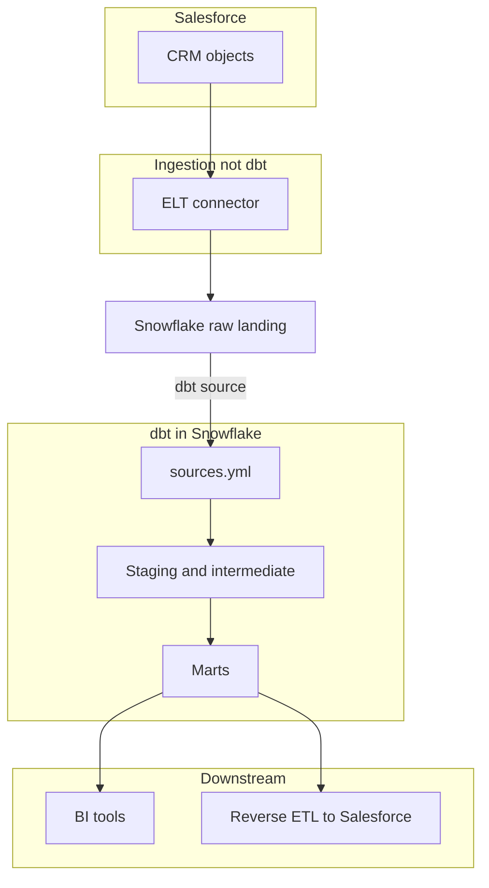

# dbt with Salesforce and Snowflake

This guide outlines how to combine **Salesforce** (CRM source), **Snowflake** (warehouse), and **dbt** (transformations). dbt runs **in Snowflake** against tables that already hold Salesforce data; loading from Salesforce into Snowflake is a separate **ingestion** step (ELT/ETL).

## Summary diagram



**Legend:** **Ingestion** loads Salesforce-shaped tables into Snowflake. The **dbt source** edge means those tables are read via the `source()` macro in dbt; then staging → marts, plus **tests and docs**. **Reverse ETL** (optional) syncs curated Snowflake data back to Salesforce (Hightouch, Census, etc.)—not part of core dbt.

---

## 1. Clarify responsibilities

| System | Responsibility |
|--------|----------------|
| **Salesforce** | System of record for CRM data; exposes objects and APIs. |
| **Ingestion** | Copies or syncs Salesforce data into Snowflake (scheduled jobs, CDC, bulk loads). |
| **Snowflake** | Stores raw and transformed data; dbt executes SQL here. |
| **dbt** | Defines transformations as versioned SQL: staging, business logic, marts, tests, documentation. |

---

## 2. Land Salesforce data in Snowflake

Choose an approach that fits compliance, latency, and cost:

1. **SaaS ELT** (common): Fivetran, Airbyte, Stitch, Matillion, etc. Prebuilt **Salesforce** connectors write to Snowflake schemas you configure.
2. **Snowflake / partner integrations**: Use vendor docs for Salesforce → Snowflake patterns (including native marketplace connectors where applicable).
3. **Custom pipelines**: Salesforce Bulk API, REST, or event streams → object storage or queue → load into Snowflake (more engineering effort).

**What you need before dbt:**

- Snowflake **database** and **schema(s)** where Salesforce tables land (e.g. `RAW.SALESFORCE` or `LANDING.SF`).
- A predictable **naming convention** (often `account`, `opportunity`, or prefixed table names from the loader).
- **Refresh cadence** understood so you can document freshness and SLAs.

Run ingestion on a schedule; dbt runs **after** raw tables exist (or use orchestration—Airflow, Dagster, dbt Cloud jobs—to order ingest → dbt).

---

## 3. Snowflake setup for analytics

1. **Warehouses** — Create a warehouse sized for dbt runs (auto-suspend/resume as needed).
2. **Databases / schemas** — Typical pattern:
   - `RAW` or `LANDING` — loader-owned tables (often read-only for analytics roles).
   - `STAGING` — dbt staging models (views or tables).
   - `ANALYTICS` or `MARTS` — business-ready tables.
3. **Roles & grants** — A role for dbt that can:
   - `SELECT` on raw Salesforce tables (or a secure view layer).
   - `CREATE` / `USAGE` on schemas where dbt builds models.
4. **Service user** — Dedicated Snowflake user for dbt (not a human login); store credentials in secrets manager or environment variables.

---

## 4. Install and configure dbt for Snowflake

1. **Install** the adapter (example with pip):

   ```bash
   pip install "dbt-snowflake>=1.7,<2"
   ```

2. **`profiles.yml`** — Add a profile (often `~/.dbt/profiles.yml`). Example shape (adjust account, user, role, warehouse):

   ```yaml
   your_project_name:
     target: dev
     outputs:
       dev:
         type: snowflake
         account: xy12345.us-east-1
         user: DBT_SVC_USER
         private_key_path: /path/to/rsa_key.p8   # or password + optional MFA
         role: DBT_ROLE
         database: ANALYTICS_DB
         warehouse: DBT_WH
         schema: STAGING
         threads: 4
   ```

   Use **key-pair auth** for service users when possible. Match `database` / `schema` defaults to where dbt should **write**; raw Salesforce data can live in another database/schema referenced in `sources.yml`.

3. **Project** — In `dbt_project.yml`, set `profile:` to the profile name and configure model paths and materializations (e.g. staging as views, marts as tables).

4. **Verify**:

   ```bash
   dbt debug
   ```

---

## 5. Declare Salesforce tables as dbt sources

Point `sources.yml` at the Snowflake relations your loader creates (not at Salesforce directly):

```yaml
version: 2

sources:
  - name: salesforce
    database: RAW_DB
    schema: SALESFORCE
    tables:
      - name: account
      - name: opportunity
        # optional: freshness on a timestamp column if the loader provides one
        # loaded_at_field: _fivetran_synced
        # freshness: ...
```

In models:

```sql
select *
from {{ source('salesforce', 'account') }}
```

Use **`ref()`** only for other **dbt models**; use **`source()`** for raw landing tables.

---

## 6. Build the dbt layer

1. **Staging** — One model per source table (or per entity): rename columns, cast types, dedupe keys, add surrogate keys if needed.
2. **Intermediate** — Joins and business logic across staging models.
3. **Marts** — Fact/dimension or wide tables for BI and metrics.

Folder convention (example): `models/staging/salesforce/`, `models/marts/`.

Set **materializations** (`view`, `table`, `incremental`) based on volume and query patterns.

---

## 7. Tests, docs, and quality

- **Generic tests** in YAML: `unique`, `not_null`, `relationships` on keys between Account and Opportunity, etc.
- **Singular tests** for business rules (e.g. closed-won opportunities must have amounts).
- **`dbt docs generate`** for lineage from raw sources through marts.

---

## 8. Orchestration and promotion

- **Order jobs**: ingestion success → `dbt run` / `dbt build` (and `dbt test` as appropriate).
- **Environments**: separate Snowflake databases or schemas for `dev` / `prod`; use `target` in `profiles.yml` and CI variables.
- **CI**: `dbt parse`, `dbt build --select state:modified+` (with artifacts) in pull requests when ready.

---

## 9. Optional — data back to Salesforce (reverse ETL)

If analysts need scores, segments, or rollups **in Salesforce**:

- Keep **curated tables or views** in Snowflake built by dbt.
- Use **reverse ETL** tools (Hightouch, Census, Omnata, etc.) to sync rows to Salesforce objects.
- dbt’s job is to **prepare** trusted data; the reverse-ETL tool handles Salesforce API limits and field mapping.

---

## 10. Security and governance checklist

- Minimize use of wide Salesforce extracts; align with **privacy** and **field-level** requirements.
- Use Snowflake **row access policies** / **masking** if PII is present.
- Rotate Snowflake credentials; avoid committing `profiles.yml` secrets to git.
- Document **ownership** of raw vs transformed layers (who owns the loader vs dbt).

---

## Quick reference commands

```bash
dbt debug
dbt run --select staging.salesforce+
dbt test
dbt build
dbt docs generate && dbt docs serve
```

---

## Further reading

- [dbt + Snowflake](https://docs.getdbt.com/docs/core/connect-data-platform/snowflake-setup)
- [dbt sources](https://docs.getdbt.com/docs/build/sources)
- [Salesforce connector patterns](https://docs.snowflake.com/) — search Snowflake docs for Salesforce and partner ELT vendor docs for your chosen tool
