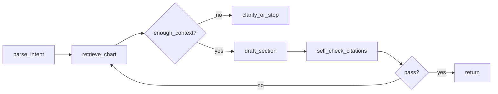

# Regard-oriented GenAI playbook: prompts, agents, and RAG

This document outlines how to **design**, **prototype**, and **evaluate** prompts, agent workflows, and retrieval-augmented generation (RAG) in a healthcare documentation context. It is aligned with the responsibilities described for Regard’s **Generative AI Engineer** role—building LLM systems that turn medical record data into **structured insights** and **clinician-ready documentation**, with emphasis on outputs that are **factual, safe, and clinically aligned**.

- **Role posting (Ashby):** [Generative AI Engineer @ Regard](https://jobs.ashbyhq.com/regard/758035db-326c-42a6-9179-f83d793b1e7b)  
- **Careers entry point:** [Regard Careers](https://regard.com/careers/?ashby_jid=758035db-326c-42a6-9179-f83d793b1e7b)

**How to use this file:** treat each checkbox as **definition of done**. **`[x]`** means satisfied for the current slice (today: [`clinical_extraction/`](clinical_extraction/README.md)); **`[ ]`** means not implemented or not in scope yet. When you ship new work under `regard/` or elsewhere, **flip the matching lines here** so this playbook stays accurate (same PR as the code, or immediately after).

**Python environment:** use `regard/venv312` (Python 3.12) for the sample implementation in [`clinical_extraction/`](clinical_extraction/README.md). It is gitignored; create it with `python3.12 -m venv regard/venv312` from the repo root, then `pip install -r regard/clinical_extraction/requirements.txt`.

---

## Table of contents

1. [Job context](#1-job-context-why-this-matters)  
2. [Repository and artifact layout](#2-repository-and-artifact-layout-implementation)  
3. [Prompts: design → prototype → evaluate](#3-prompts-design--prototype--evaluate)  
4. [Agent workflows: design → prototype → evaluate](#4-agent-workflows-design--prototype--evaluate)  
5. [RAG: design → prototype → evaluate](#5-rag-design--prototype--evaluate)  
6. [Cross-cutting: safety, ops, compliance](#6-cross-cutting-safety-ops-compliance)  
7. [Release and regression gates](#7-release-and-regression-gates)  
8. [Relation to this repository](#8-relation-to-this-repository)  

---

## 1. Job context (why this matters)

From the role overview and responsibilities, the work spans the **full lifecycle**: ideation, design, prototyping, implementation, evaluation, and iteration, in collaboration with **product** and **clinical** stakeholders. Typical problem shapes include:

- **Extraction & normalization:** structured concepts (diagnoses, medications, labs, timelines) from unstructured EHR text.
- **Generation:** drafts of clinical notes (e.g., H&P, progress notes, discharge summaries) from **grounded, factual inputs**.
- **Systems engineering:** robust pipelines, model and prompt experiments, production integration, and **auditable accuracy**.
- **Operational quality:** benchmarking new models, optimizing **cost, latency, and throughput** (batching, caching, model selection).

Everything below should be read through that lens: **patient safety**, **clinical utility**, and **defensibility** of outputs matter as much as raw fluency.

---

## 2. Repository and artifact layout (implementation)

Use a **single place** per feature (or per domain) so prompts, evals, and RAG configs stay traceable.

- [x] Create a top-level folder for the initiative, e.g. `regard/<feature_name>/` (or your monorepo equivalent).
- [x] Store **prompts as files** (`.md`, `.jinja`, or `.yaml` with `system` / `user` blocks)—never only in notebooks.
- [x] Store **frozen eval sets** under `evals/gold/` (git-lfs or internal store if large); never mutate rows in place—version filenames (`v2026-04-13.jsonl`).
- [x] Store **run outputs** under `evals/runs/<run_id>/` (gitignored) with `manifest.json` pointing to prompt hash, model, git SHA, dataset version.
- [x] Add a **`README.md` per feature** with: owner, clinical reviewer, SLO (latency/cost), and link to rubric doc.

Suggested layout (adapt names to your stack):

```text
regard/<feature>/
  README.md                 # scope, owners, SLOs
  prompts/
    manifest.yaml           # prompt_id -> file path, version, changelog
    extraction_v3/
      system.md
      user.jinja
  schemas/
    extraction_output.json  # JSON Schema for model output
    tool_io.json            # tool request/response schemas (agents)
  evals/
    gold/
      cases.jsonl           # one JSON object per line (see §3.4)
    rubrics/
      note_quality.md       # human + LLM-judge instructions
    scripts/
      run_eval.py           # loads gold, calls API, writes runs/
  rag/
    chunking.yaml           # strategy, token limits, metadata fields
    retrieval.yaml          # top_k, hybrid weights, filters
  agents/
    workflow.yaml           # graph/steps, caps, tool allowlist
```

- [x] **`manifest.yaml` for prompts** includes at minimum: `prompt_id`, `version`, `path`, `owner`, `created_at`, `eval_dataset_id` it was validated against, `model_allowlist`.

---

## 3. Prompts: design → prototype → evaluate

### 3.1 Design — specification checklist

- [x] **Task ID** and one-sentence **user story** (clinician or downstream system).
- [x] **Inputs** listed with type: unstructured text / structured FHIR-like JSON / retrieved chunks with `chunk_id`.
- [x] **Output contract:** JSON Schema **or** Pydantic model name + field descriptions; required vs optional fields explicit.
- [x] **Grounding rule:** “Answer only from provided context; if insufficient, return `insufficient_context: true` and list missing info.” (wording tuned with clinical).
- [x] **Forbidden behaviors** enumerated (e.g., no new diagnoses, no medication changes, no patient-identifying info in logs).
- [x] **System vs user split:** system = policy + format; user = patient-specific facts + retrieval blocks.
- [x] **Citation rule:** every clinical claim maps to `chunk_id` or `source_span` when chunks exist.
- [x] **Token budget** per section (max bullets, max words) documented in the spec.

**Prompt spec template** (copy into `prompts/<name>/SPEC.md`):

```markdown
## Task ID
## Stakeholders (product, clinical, eng)
## Inputs (with examples)
## Output schema (link to schemas/…)
## Edge cases (empty chart, conflicting notes, stale labs)
## Safety / refusal behavior
## Success metrics (link to eval case IDs)
```

### 3.2 Design — structured output (implementation)

- [x] Define **JSON Schema** under `schemas/` and validate every model response with a library (e.g. `jsonschema`, Pydantic `model_validate_json`).
- [x] Add **`_meta` object** in schema for: `prompt_version`, `model`, `warnings[]` *(this slice keeps `insufficient_context` at the top level of the payload, not inside `_meta`.)*
- [x] Unit tests: **golden files** for parser—valid JSON, malformed JSON, truncated JSON recovery policy.

Example **minimum fields** for extraction-style tasks:

```json
{
  "entities": [],
  "citations": [{ "chunk_id": "string", "quote": "string" }],
  "insufficient_context": false,
  "clarifying_questions": [],
  "_meta": { "prompt_version": "extraction_v3", "model": "…" }
}
```

### 3.3 Prototype — execution checklist

- [x] Script or notebook **`run_one(case_id)`** that loads prompt template + fills variables from gold row *(implemented as `run_eval.py --case-ids`.)*
- [x] **Decoding grid** recorded: temperature, top_p, max_tokens, seed (if supported); store in `manifest.json`.
- [x] **Prompt hash:** SHA-256 of rendered system+user strings logged per request.
- [x] **Failure probes** as a dedicated `evals/gold/stress.jsonl` (empty context, contradictory sentences, garbage/OCR, wrong-language snippet).
- [x] **Cost estimate:** tokens in/out per case from provider logs; aggregate in eval summary.

### 3.4 Evaluate — gold dataset schema (implementation)

Each line in `cases.jsonl` should be valid JSON. **Minimum columns:**

| Field | Purpose |
|--------|---------|
| `case_id` | Stable ID for regression tracking |
| `input` | Chart excerpt, structured record, or pointers to internal doc IDs |
| `retrieved_chunks` | Optional list `{chunk_id, text, metadata}` for RAG evals |
| `expected` | Structured gold (slots, spans, or reference note text) |
| `rubric_tags` | e.g. `["pediatric", "med_reconciliation"]` for stratified metrics |
| `notes_for_judge` | Non-leaking hints for human/LLM graders |

- [x] **Stratified reporting:** metrics broken out by `rubric_tags` *(document length quartiles: not yet.)*
- [x] **Schema validation rate:** % outputs passing JSON Schema (gate at ≥ agreed threshold).
- [x] **Slot metrics:** per-field precision/recall or exact match for coded fields.
- [x] **Hallucination protocol:** list of claims extracted from model output → each marked supported / unsupported / contradicted by `input`+`retrieved_chunks` (human or secondary model with **blinded** inputs). *(Deterministic `evals/scripts/claim_support_report.py`: entity values vs merged chart + chunk texts + citation quotes; substring + token fallback. **Contradiction** not auto-detected—use human or blinded LLM for that and for ambiguous cases.)*
- [x] **LLM-as-judge:** rubric in `evals/rubrics/`; calibrate on ≥ N human-scored cases; report agreement (Cohen’s kappa or match rate). *(Live: `evals/scripts/llm_judge_eval.py` with blinded inputs + `schemas/judge_output_openai.json`. **Dry-run** uses deterministic proxy from grounding + recall + stress. **`--human-scores`** JSONL → `match_rate` + unweighted Cohen’s κ on overlapping `case_id`s. Example human rows: `evals/human_scores.example.jsonl`.)*
- [x] **Regression:** compare run to `baseline_run_id`; fail if any **primary metric** drops > agreed delta.

### 3.5 Evaluate — `run_eval.py` behavior checklist

- [x] Load `manifest.yaml` + dataset version + git SHA into `runs/<id>/manifest.json`.
- [x] Idempotent: same `run_id` does not append duplicate rows unless `force` flag.
- [x] Write **`predictions.jsonl`** aligned by `case_id` with raw model output + parse status.
- [x] Write **`metrics.json`** with aggregates + per-stratum breakdown + latency p50/p95 + cost.
- [x] Exit non-zero if regression gates fail (for CI).

---

## 4. Agent workflows: design → prototype → evaluate

### 4.1 Design — workflow spec checklist

- [x] **State machine diagram** (Mermaid or image) checked into `agents/` (e.g. `workflow.mmd`).
- [x] **State object schema:** typed fields the graph reads/writes each step (e.g. `Scratchpad`, `RetrievedChunk[]`, `DraftNote`, `Errors[]`).
- [x] **Tool inventory table:** name, input schema, output schema, timeout, idempotency, rate limit.
- [x] **Caps:** `max_steps`, `max_tool_calls`, `max_wall_ms`, `max_tokens_total`.
- [x] **Escalation:** when to return partial result + human task vs retry vs fail closed.
- [ ] **Tracing:** OpenTelemetry span names per step; **no raw PHI** in span attributes—use hashed IDs.

Example **Mermaid** stub for documentation:



### 4.2 Prototype — implementation checklist

- [x] **Thin vertical slice:** one `case_id` runs end-to-end with mocked tools first, then real APIs.
- [x] **Tool stubs** return fixed payloads for unit tests; contract tests assert schema + error paths.
- [x] **Replay fixture:** serialized tool responses for deterministic CI (`agents/fixtures/`).
- [x] **Parallelism policy:** document which steps may run concurrently vs must be sequential for clinical consistency.

### 4.3 Evaluate — agent-specific metrics

- [ ] **Task success rate:** rubric-based or exact match on final structured output vs gold.
- [ ] **Trajectory length:** distribution of steps and tool calls; flag p95 regression.
- [ ] **Tool error recovery:** % runs that hit tool failure and still succeed safely (or fail closed correctly).
- [ ] **Duplicate / useless calls:** count repeated identical tool calls; gate if above threshold.
- [ ] **Human effort:** if available, track edit distance or time-to-accept for clinician-facing drafts.

### 4.4 Observability checklist (agents)

- [ ] **Trace ID** propagated from API gateway through every tool call.
- [ ] **Structured log** per step: `step_name`, `duration_ms`, `tool_name`, `outcome`, `retry_count` (no PHI).
- [ ] **Debug bundle** export for a single `trace_id` (internal only): prompts, tool I/O, final output—access-controlled.

---

## 5. RAG: design → prototype → evaluate

### 5.1 Design — corpus and metadata checklist

- [x] **Document inventory:** note types, lab reports, imaging summaries, etc.; include **exclusion rules** (e.g. broken PDFs). *(Documented in `rag/chunking.yaml` / slice defaults; not wired to a real corpus.)*
- [ ] **Access model:** which roles see which chunks; index partitioned if needed.
- [x] **Freshness SLO:** max acceptable lag between source update and index visibility. *(Targets in `rag/retrieval.yaml`.)*
- [x] **Chunk metadata schema** agreed and enforced at index time:

| Field | Example | Use |
|--------|---------|-----|
| `chunk_id` | UUID | Citations |
| `patient_id` | internal ref | Filtering (hashed in logs) |
| `encounter_id` | internal ref | Scoped retrieval |
| `doc_type` | `progress_note` | Filters |
| `section` | `Assessment` | Boosting |
| `effective_time` | ISO-8601 | Time-range queries |
| `source_uri` | internal pointer | Audit |

### 5.2 Design — chunking implementation checklist

- [x] **Strategy documented:** fixed-token vs heading-based vs encounter-window; overlap size; max chunk size.
- [x] **Deduplication:** hash text to skip identical chunks across exports.
- [x] **Parent/child chunks** (optional): small retrieval units + larger context expansion for generation.

### 5.3 Prototype — indexing pipeline checklist

- [ ] **Ingestion job:** idempotent on `(source_version, doc_id)`.
- [x] **Embedding model** name + dimension + version pinned in `rag/chunking.yaml`.
- [ ] **Vector store** + **lexical index** (if hybrid) provisioned; backup/restore documented.
- [ ] **Incremental updates:** tombstone or version field for deleted/corrected notes.
- [x] **Backfill playbook:** steps to re-embed when embedding model changes. *(Described in `rag/chunking.yaml`.)*

### 5.4 Prototype — retrieval configuration checklist

- [x] `retrieval.yaml` lists: `top_k`, `mmr_lambda`, hybrid α (dense vs sparse), **reranker** model if any.
- [x] **Query rewriting** behind a flag; A/B only after offline gain on gold queries.
- [x] **Filters:** time window, `doc_type`, encounter—exposed as explicit API parameters to avoid prompt injection into filters.

### 5.5 Evaluate — RAG gold and metrics checklist

- [x] **Query set** with `gold_chunk_ids` or character spans in source docs (not only free-text answers).
- [x] **Retrieval metrics:** precision@k, MRR, or nDCG per case; report micro and macro averages.
- [ ] **Answer faithfulness:** each sentence in answer linked to supporting chunk or marked unsupported.
- [ ] **Ablation notebook or script:** sweep `top_k`, reranker on/off, hybrid weights; save plots to `evals/runs/…/plots/`.
- [ ] **Operational:** index size per tenant, p95 retrieval latency, embedding cost per 1M tokens ingested.

### 5.6 RAG + agent integration checklist

- [ ] Retrieval exposed as a **tool** with arguments: `query`, `time_from`, `time_to`, `doc_types[]`, `top_k`. *(Contract in `schemas/tool_io.json`; no live tool runtime.)*
- [x] **Hard cap** on retrieve calls per workflow run (see §4.1).
- [x] **Citation pass:** final generation step must emit `citations` referencing `chunk_id` from tool results only. *(Enforced via prompts + eval for this slice.)*

---

## 6. Cross-cutting: safety, ops, compliance

### 6.1 Clinical and product alignment

- [ ] **Rubric doc** signed by clinical stakeholder for note types you generate.
- [ ] **Periodic failure review:** top N error clusters from production or pilot; tickets filed with prompt/workflow version.

### 6.2 Safety testing (red team)

- [x] **Adversarial case file:** wrong-patient context, instructions embedded in “patient quote”, requests for prohibited advice.
- [x] **Expected behavior** documented per case: refuse, strip instruction, or escalate.
- [ ] **Automated run** of red-team file on every prompt major version bump. *(Stress set runs in CI via full `pytest` / dry harness; not gated only on prompt semver.)*

### 6.3 Model benchmarking

- [x] **Same harness** for all candidate models (`metrics.json` comparable across runs).
- [x] **Cost/latency table** exported: $/1k cases, p95 ms, quality metrics side-by-side. *(Compare via `compare_metrics.py` + `metrics.json` / tokens.)*

### 6.4 Logging and privacy

- [ ] **PHI minimization:** logs store IDs + hashes; full prompts only in restricted debug store.
- [ ] **Retention** limits documented; support delete/export per policy.
- [x] **Data flow diagram** for RAG: source → index → retrieval → LLM vendor (for security review).

### 6.5 On-call and reliability (role-aligned)

- [x] **Runbooks** for: embedding provider outage, vector DB degradation, model 429/latency spike.
- [ ] **Feature flags** to disable agent paths or fall back to simpler retrieve+single-shot prompt.

---

## 7. Release and regression gates

Use this as a **pre-merge / pre-release** checklist.

- [x] Prompt version in `manifest.yaml` bumped; changelog entry links to PR.
- [x] `evals/gold/` dataset version bumped if cases changed; old version archived. *(Versioned filename + docs; archive policy is manual.)*
- [x] `run_eval.py` completed; `metrics.json` attached to PR or ticket.
- [x] No regression on **primary metrics** vs baseline; strata reviewed for surprises.
- [x] Schema validation pass rate ≥ threshold; hallucination / unsupported-claim rate ≤ threshold (if measured). *(Schema gate + baseline; hallucination rate not automated.)*
- [ ] RAG retrieval metrics stable if retrieval config changed. *(N/A until real index + repeated runs.)*
- [ ] Agent trajectory p95 steps/tool calls within SLO.
- [ ] Clinical or delegated reviewer sign-off recorded for user-facing wording or note structure changes.

---

## 8. Relation to this repository

The parent project includes tutorials and tooling for RAG and LLM workflows (for example under `rag_with_llamaindex/`). Reuse those patterns for **prototyping**, but implement the **folder layout, manifests, gold sets, and gates** above for anything you treat as production- or pilot-grade.

---

*This README is an engineering playbook derived from public job posting text and Regard’s stated mission and values on their careers site; it is not affiliated with or endorsed by Regard.*
