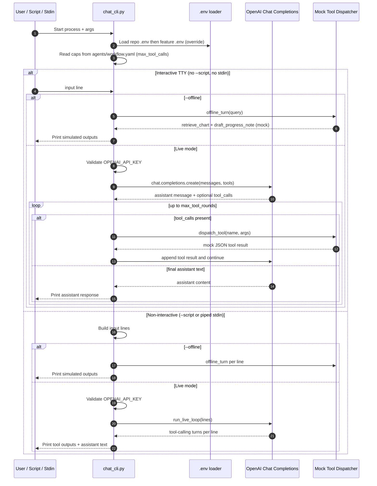

# Clinical extraction (sample vertical slice)

End-to-end scaffold for **grounded clinical concept extraction** from chart excerpts: prompts on disk, JSON Schema + Pydantic validation, gold eval sets, `run_eval.py`, RAG YAML, and a documented agent workflow.

| Field | Value |
|--------|--------|
| **Engineering owner** | _TBD_ |
| **Clinical reviewer** | _TBD_ |
| **Product link** | _TBD_ |
| **SLO (latency)** | p95 under _TBD_ ms per case (offline eval) |
| **SLO (cost)** | under _TBD_ USD per 1k cases at agreed model |
| **Rubric** | [`evals/rubrics/note_quality.md`](evals/rubrics/note_quality.md) |

## Quickstart

Use the shared **Python 3.12** environment under `regard/venv312` (created once at repo root):

```bash
cd /path/to/python_project
python3.12 -m venv regard/venv312   # if it does not exist yet
source regard/venv312/bin/activate   # Windows: regard\venv312\Scripts\activate
pip install -r regard/clinical_extraction/requirements.txt

cd regard/clinical_extraction
export PYTHONPATH="../.."   # repo root so `regard.*` imports work

# Dry run (no API key): validates harness + schema + metrics
python evals/scripts/run_eval.py --dry-run --include-stress

# Live smoke (1 case; loads OPENAI_API_KEY from clinical_extraction/.env or repo .env)
cp .env.example .env   # once; add your key
python evals/scripts/run_eval.py --max-cases 1 --model gpt-4o-mini

# Full live eval + stress
python evals/scripts/run_eval.py --include-stress --model gpt-4o-mini

# Only specific cases (order preserved; include stress rows only if listed + loaded)
python evals/scripts/run_eval.py --dry-run --include-stress --case-ids ce-001,stress-002

# Export a run’s predictions to CSV for review (optional: merge gold JSONL for triage)
python evals/scripts/export_predictions_csv.py evals/runs/<run_id>/predictions.jsonl \
  --gold-jsonl evals/gold/cases_v2026-04-13.jsonl --gold-jsonl evals/gold/stress.jsonl

# LLM-as-judge (dry proxy, no key) or live judge — see docs/EVAL_WORKFLOW.md
python evals/scripts/llm_judge_eval.py evals/runs/<run_id>/predictions.jsonl --dry-run

# Agent replay metrics + trajectory p50/p95 over all fixtures (see docs/runbooks.md)
python agents/workflow_stub.py --fixtures-dir agents/fixtures

# RAG: retrieval precision@k, top_k ablation, answer faithfulness on a fixture (see docs/EVAL_WORKFLOW.md §6)
python evals/scripts/retrieval_metrics.py
python evals/scripts/rag_ablation.py --top-k-values 1,3,5,8
python evals/scripts/answer_faithfulness.py agents/fixtures/trace_ce-003.json

# Prompt major.minor gate (CI); failure review from predictions (see docs/runbooks.md)
python evals/scripts/verify_prompt_stress_gate.py
python evals/scripts/failure_review_summarize.py evals/runs/<run_id>/predictions.jsonl -o /tmp/review.md

# Multi-turn agent CLI (OpenAI tool-calling; tools are mocked — no real vector DB)
# Offline (no key):  python agents/chat_cli.py --offline --script agents/chat_example.txt
# Live (key in .env):  cp .env.example .env  # once; same OPENAI_API_KEY as run_eval
#   then:  python regard/clinical_extraction/agents/chat_cli.py --script agents/chat_example.txt
#   or:    python regard/clinical_extraction/agents/chat_cli.py   # interactive; loads repo .env then this folder’s .env
# Interactive mock:  python agents/chat_cli.py --offline

# Tests (from repo root)
cd ../.. && pytest regard/clinical_extraction/tests -q
# or: make -C regard/clinical_extraction test
```

### Agent CLI flow (`agents/chat_cli.py`)

The CLI supports three execution modes: **interactive TTY**, **script file** (`--script`), and **stdin** (piped input). In live mode, it loads env vars from repo-root `.env` and then `clinical_extraction/.env`, checks `OPENAI_API_KEY`, and runs OpenAI tool-calling with mocked tool handlers.



Behavior details:
- `--offline` never calls OpenAI; it runs a canned retrieve + draft path for each input line.
- Live tool calls are bounded by `--max-tool-rounds` (default derived from `agents/workflow.yaml` and capped to 12).
- Tool contracts exposed to the model are `retrieve_chart` and `draft_progress_note`, but both currently return mock data for safe workflow testing.

Step-by-step eval flow: [`docs/EVAL_WORKFLOW.md`](docs/EVAL_WORKFLOW.md).

When this slice gains new capabilities that satisfy items in the parent playbook, **update the checkboxes** in [`../README.md`](../README.md) in the same PR (or immediately after).

**Regression:** committed [`evals/baseline_metrics.json`](evals/baseline_metrics.json) gates dry-run quality (8 cases); `pytest regard/clinical_extraction/tests/`. CI runs the same suite on push/PR (see repo [`.github/workflows/regard-clinical-extraction.yml`](../../.github/workflows/regard-clinical-extraction.yml)).

**Live baseline:** gitignored `evals/baseline_metrics_live.json` is set from run **`98bf4fe5c9ee`** (see [`docs/EVAL_WORKFLOW.md`](docs/EVAL_WORKFLOW.md) §4). Older example: [`evals/baseline_metrics_live.json.example`](evals/baseline_metrics_live.json.example). Live evals default to OpenAI **`json_schema`** strict output; use `--no-strict-schema` to force `json_object` only.

## Layout

See the parent playbook [`../README.md`](../README.md) §2. This folder follows that layout.

## Related commands

| Script | Purpose |
|--------|---------|
| `evals/scripts/run_eval.py` | Batch eval → `evals/runs/<run_id>/` (`--case-ids`, `--strict-recall`) |
| `evals/scripts/export_predictions_csv.py` | `predictions.jsonl` → CSV; `--gold-jsonl` (repeat) merges labels |
| `evals/scripts/summarize_run.py` | Human-readable stats from `predictions.jsonl` (+ optional `metrics.json`) |
| `evals/scripts/compare_metrics.py` | Diff two `metrics.json` (baseline vs new run) |
| `Makefile` | `test`, `eval-dry`, `*-help` targets |
| `evals/scripts/retrieval_metrics.py` | Precision@k vs `gold_chunk_ids` on gold rows |
| `agents/workflow_stub.py` | Mocked vertical slice + fixture replay |

**Entity recall** defaults to **normalized** text (case, whitespace, trailing punctuation). Use **`--strict-recall`** for exact string match vs gold.
