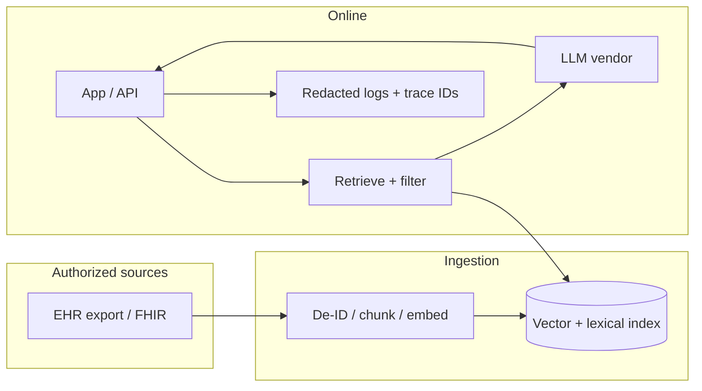

# Data flow (RAG + LLM) — review artifact

High-level flow for security and compliance reviews. Replace placeholders with your actual systems.

## Notes

- **PHI minimization:** production logs should carry hashed patient/encounter IDs and omit raw note text except in restricted debug storage.
- **Deletion:** index rows must be tied to source document versions so corrections and deletes propagate.
- **Vendor:** document subprocessors and data processing agreements for the LLM provider used in `run_eval.py` live mode.
